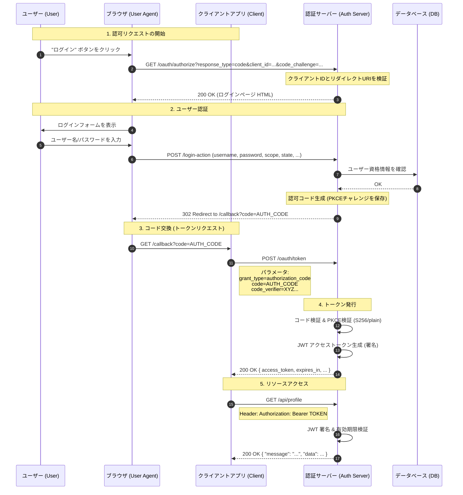

# OAuth 2.0 Authorization Code Flow with PKCE Sequence Diagram

This diagram illustrates the flow implemented in this project.

```mermaid
sequenceDiagram
    autonumber
    participant User as ユーザー (User)
    participant Browser as ブラウザ (User Agent)
    participant ClientApp as クライアントアプリ (Client)
    participant AuthServer as 認証サーバー (Auth Server)
    participant Database as データベース (DB)

    Note over User, ClientApp: 1. 認可リクエストの開始
    User->>Browser: "ログイン" ボタンをクリック
    Browser->>AuthServer: GET /oauth/authorize?response_type=code&client_id=...&code_challenge=...
    
    Note over AuthServer: クライアントIDとリダイレクトURIを検証
    AuthServer-->>Browser: 200 OK (ログインページ HTML)
    
    Note over User, AuthServer: 2. ユーザー認証
    Browser->>User: ログインフォームを表示
    User->>Browser: ユーザー名/パスワードを入力
    Browser->>AuthServer: POST /login-action (username, password, scope, state, ...)
    
    AuthServer->>Database: ユーザー資格情報を確認
    Database-->>AuthServer: OK
    
    Note over AuthServer: 認可コード生成 (PKCEチャレンジを保存)
    AuthServer-->>Browser: 302 Redirect to /callback?code=AUTH_CODE
    
    Note over Browser, ClientApp: 3. コード交換 (トークンリクエスト)
    Browser->>ClientApp: GET /callback?code=AUTH_CODE
    ClientApp->>AuthServer: POST /oauth/token
    Note right of ClientApp: パラメータ:<br/>grant_type=authorization_code<br/>code=AUTH_CODE<br/>code_verifier=XYZ...
    
    Note over AuthServer: 4. トークン発行
    AuthServer->>AuthServer: コード検証 & PKCE検証 (S256/plain)
    AuthServer->>AuthServer: JWT アクセストークン生成 (署名)
    AuthServer-->>ClientApp: 200 OK { access_token, expires_in, ... }
    
    Note over ClientApp, AuthServer: 5. リソースアクセス
    ClientApp->>AuthServer: GET /api/profile
    Note right of ClientApp: Header: Authorization: Bearer TOKEN
    AuthServer->>AuthServer: JWT 署名 & 有効期限検証
    AuthServer-->>ClientApp: 200 OK { "message": "...", "data": ... }
```
